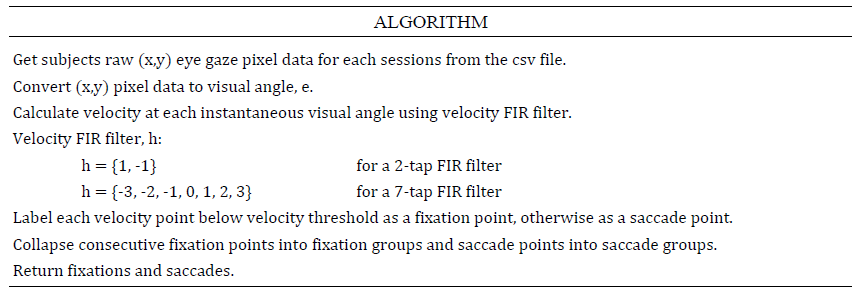
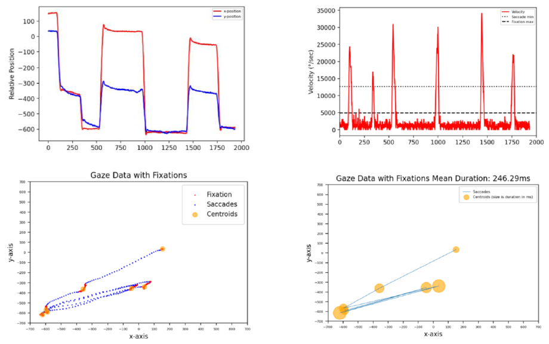
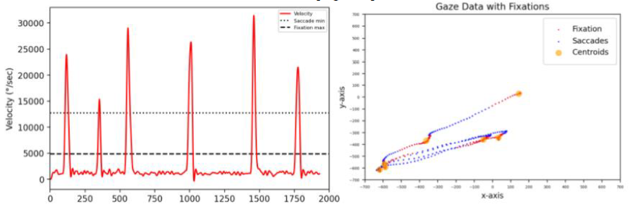
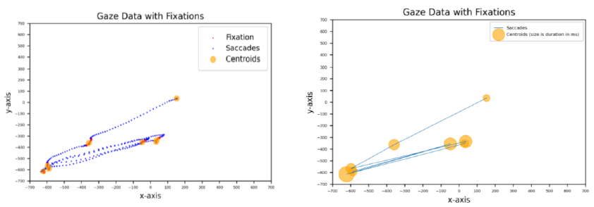
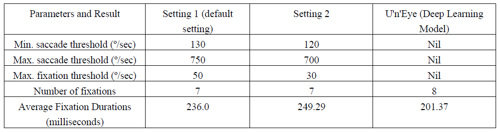
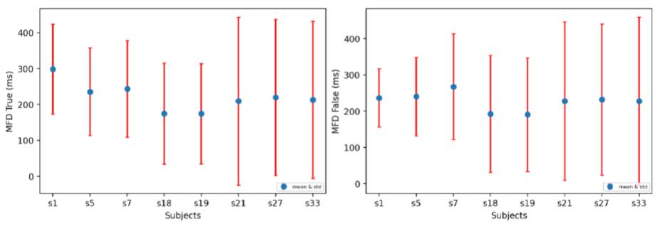
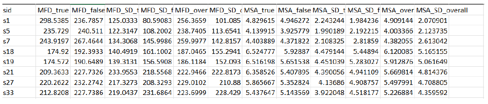

# Eye-Tracking
## Introduction
The objective of the project is to learn how to analyze and visualize eye-tracking data. The dataset consists of rows (one row per one session and one subject) of raw gaze locations x,y recorded in time. Subjects have multiple rows/samples in the dataset. The dataset has been recorded in a situation where subjects were shown images and had to indicate if they recognized the image or not. Python was used to visualize and manipulate the data, and we created an algorithm to get a better understanding of what the participants were fixating or focusing on while partaking in the experiment. The U'n'Eye deep learning model was also used on the data and we achieved similar results to our own algorithms.

## ALGORITHMS
Salvucci et al. [1] used several algorithms for fixation and saccade identification. One of these was a Velocity Threshold Identification (I-VT) algorithm that differentiates between fixations and saccades using their point to point velocities. Duchowski [2] described using short (Finite Impulse Response) filters to detect saccades and fixation events in gaze data. Our algorithm is based on both Salvucci and Duchowski’s algorithms. We calculated the point to point velocity of each gaze data point using a short FIR filter and classified each data point as fixation or saccade points based on some predefined fixation and saccade thresholds. Nyström et al. [3] use an adaptive algorithm for detecting fixations, saccades and glissades but the threshold must be determined statistically from the input data.

## DATA
The data is in the form of a csv file which we manipulated using python. It consists of x and y position data for the pupils of 34 subjects over multiple sessions with each. The data was recorded as participants were shown images and asked to mention whether or not they recognized the image. The participants were seated 450mm from the screen. The participants were seated 450mm from a screen of 195mm x 113mm during this data gathering process.

## PLOTS AND ANALYSIS
The relative x, y position plot to visualize the aforementioned data is shown in [Figure A] and its velocity against data point plot is shown in the first plot below. Using our algorithm to detect all fixations and saccade data points in the velocity signal would result in the detection of seven fixations with an average fixation duration of 246.29ms and six saccades. This is shown in plot first and second plot. The last plot is the plot of all fixation centroids - represented by circles with radius equivalent to the fixations’ duration in milliseconds.

The Algorithm makes use of a 2-tap FIR velocity filter in our implementation. It is obvious that there is a lot of noise in the velocity signal. The noise in the dataset might have been caused due to the imperfection of the eye-tracker, interference from the subject or environment. We can eliminate or reduce this noise by passing the velocity signal through a low-pass filter. The resulting signal after passing it through a low-pass filter is shown in the firstt plot below. Applying our algorithm on the denoised velocity signal to detect fixations and saccades yields seven fixations with an average fixation duration of 244.57ms and six saccades as shown in the second plot below.

As shown above, denoising the velocity signal before fixation detection results in inaccurate detection of fixation and saccade data points due to loss of velocity data points after this operation. Since it gives less accurate results when compared to not removing noise from the signals, we decided to not remove noise from the raw velocity data in our implementation by default.

The U'n'Eye model is trained using the “Synthetic” data from the U'n'Eye module. It is mostly able to differentiate between saccades and fixations when presented with new eye tracking data. The saccades detected by the U'n'Eye model are longer and the fixations are shorter, in comparison to our own algorithm. Saccades are occasionally missed, or as seen above, extra saccades and fixations can be erroneously detected. In this case the average fixation duration has been reduced as the erroneous fixation is absorbing some time. The results using the module are shown below.

The table below summarizes the parameters and results of our algorithm and the deep learning model.

## DISCUSSION OF RESULTS
Our algorithm and the U'n'Eye module gave us consistent results. The fixation duration is consistently higher using the first settings. The fixation centroids remain similarly positioned. The U'n'Eye model detects significantly smaller fixations than either setting of our algorithm. When comparing the results in terms of different subjects, subject_id 1 stands out as having an incredibly high mean fixation duration. Assuming that the stimulus was equally interesting, the subject may simply absorb information more slowly or carefully.
Except from subject 1, all other subjects tend to have more fixation durations on images they don't recognize than images they recognize. From the MSA x MFD plots below, s18 and s19 seems to process the images faster than the other participants. Also, subject 1 and 7 processed the images slower when compared to the other participants.

The following plots show the MFD x MSA plot for true and false for the overall dataset.

Finally, the aggregated mean fixation duration (MFD) for the overall dataset is 225.4907073569226ms and the standard deviation is 25.907918663824777. the aggregated mean saccade amplitude (MSA) for the overall dataset is 5.2152766583373875° and the standard deviation is 0.6936041351019592. The image below shows a snippet of the output csv file of our result.

## REFERENCES
1. Salvucci, D. D., & Goldberg, J. H. (2000). Identifying fixations and saccades in eye-tracking protocols. Proceedings of the Symposium on Eye Tracking Research & Applications - ETRA ’00. doi:10.1145/355017.35502
2. Krejtz, K., Duchowski, A. T., Niedzielska, A., Biele, C., & Krejtz, I. (2018). Eye tracking cognitive load using pupil diameter and microsaccades with fixed gaze. PLOS ONE, 13(9), e0203629. doi:10.1371/journal.pone.0203629
3. Nyström, M., & Holmqvist, K. (2010). An adaptive algorithm for fixation, saccade, and glissade detection in eyetracking data. Behavior Research Methods, 42(1), 188–204. doi:10.3758/brm.42.1.188
